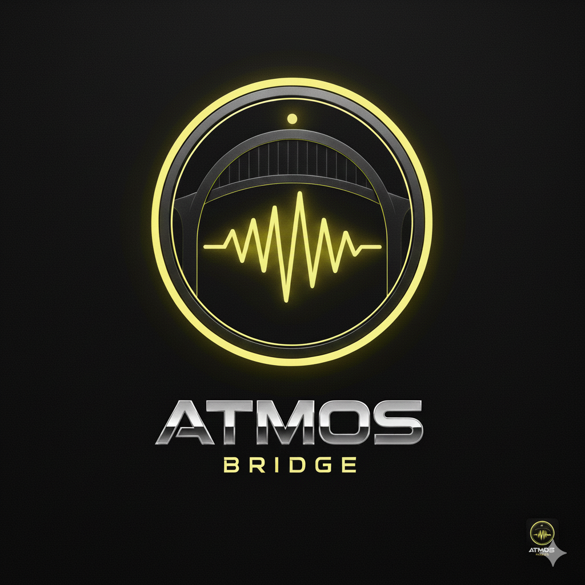

# Atmos Bridge for Nobara
A lightweight bridge to sync Dolby Atmos workflows with Ableton Live on Linux.

## 🚀 Features
- **Wayland Native**: Optimized for modern Linux display servers.
- **PipeWire Integration**: Low-latency audio handling.
- **Easy GUI**: Built with PyQt6 for a smooth user experience.

## 🛠️ How to Run
1. Clone the repo: `git clone [your-url]`
2. Install dependencies: `pip install PyQt6`
3. Run the app: `python main.py`
A performance-tuned bridge for running **Ableton Live 12** on Nobara Linux. Optimized specifically for the **Heavys H1H** headset and Wayland stability.

## ⚠️ ZEN MODE NOTICE: Fullscreen Only
This bridge is designed for professional workflow. Upon launch, the script will force Ableton into **True Fullscreen Mode**. This prevents "Top-Left Corner" locking and black-screen flickering common in Wine/Wayland environments.

### Navigation & Hotkeys
Since the window is locked to the front, use these standard shortcuts to manage your session:
* **Alt + F**: Opens the "File" menu (Use this to Save/Quit).
* **Alt + Tab**: Switch back to the Nobara Audio Hub or other apps.
* **Super (Windows Key)**: Brings up the Nobara taskbar/dock if you need to exit.
* **Ctrl + S**: Standard Save shortcut.

## Key Features
* **X11 Geometry Kick:** Auto-clears the Wine "black box" render bug.
* **PipeWire Auto-Link:** Bridges `Atmos_Bridge` directly to Heavys H1H Bluetooth nodes.
* **Real-Time Priority:** Automatically `renice` the process to -20 for flawless sampling.
* **Path Persistence:** Remembers your `.exe` location after the first setup.

## Installation
1. Install dependencies: `sudo dnf install wmctrl pipewire-utils wine`
2. Clone this repo.
3. Run `python3 main.py`.
4. Select your Ableton executable and hit **Launch**.

---
*Created for the Nobara Linux Community.* in Conjuction with ---
### 🛠️ Credits & Support
 G#OST TREASURE STUDIO** Follow the project on GitHub: [treasurestudio](https://github.com/treasurestudio)

*Created for the Nobara Linux Music Production Community.*
*
*
*BIG NOTICE ABOUT THE MISSING MENU!!!
🎹 G#OST TREASURE STUDIO | Linux Audio Hub

This Hub is designed to launch Ableton Live 12 on Linux (Nobara/KDE) with optimized low-latency audio routing via Pipewire and a virtual Atmos Bridge.
🚀 Quick Start

    Install Dependencies:
    Bash

    sudo dnf install wmctrl xdotool wine

    Setup Options: Ensure your Options.txt file (located in your Ableton Preferences folder) includes:

        -_NoCustomWindowFrame

        -_ForceGdiBackend

    Launch: Run main.py and hit Launch DAW.

🛠 Linux Menu Troubleshooting

Due to Wine rendering quirks, the top menu bar (File, Edit, Options) may be invisible or unclickable. The menus are still functional via Alt-Key Shortcuts.

Blind Navigation Table: | Shortcut | Menu Category | Common Use Case | | :--- | :--- | :--- | | Alt + F | File | Save (S), Export (R), New Set (N) | | Alt + E | Edit | Undo (Z), Redo (Y), Loop Selection (L) | | Alt + O | Options | Preferences (P), Plugin Management | | Alt + V | View | Toggle Fullscreen, Show Mixer/Arrangement | | Alt + H | Help | Manual and Tutorials |

    Pro-Tip: If the window feels "frozen" or doesn't respond to clicks, tap the Alt key once. This forces the Linux window manager to refresh the focus on the Wine container.

🎧 Audio Routing

The Hub automatically builds an Atmos_Bridge null-sink.

    Input: Set Ableton's Audio Output to Atmos_Bridge (via WineASO or PulseAudio).

    Output: The Hub automatically patches the Bridge to your detected hardware (USB Interface, Heavys Headphones, or Bluetooth).

⌨️ Keyboard Fixes

    Numbers not working? Press M to toggle off the "Computer MIDI Keyboard."

    Skinny Window? The script automatically attempts to resize the window to 1600x900 upon launch to fix geometry glitches.

    
    
    📥 Installation & Setup Guide
1. System Requirements

This hub is optimized for Nobara/Fedora (KDE Plasma) but works on most Pipewire-based Linux distributions.

    Pipewire (for low-latency audio)

    Wine-Staging (recommended for DAW compatibility)

    Python 3.10+

2. Installing Dependencies

Open your terminal and run the following to install the necessary window management and audio tools:
Bash

sudo dnf install wmctrl xdotool pipewire-utils python3-pyqt6 wine winetricks

3. Setting up the Environment

To fix the common "Invisible Menu" and "Skinny Window" bugs in Wine, you must create an Options.txt file for Ableton:

    Navigate to: ~/.wine/drive_c/users/[User]/AppData/Roaming/Ableton/Live 12.x/Preferences/

    Create Options.txt and add:
    Plaintext

    -_ForceGdiBackend
    -_DisableGraphicsHardwareAcceleration
    -_NoCustomWindowFrame

4. Running the Hub

Clone this repository and run the main script:
Bash

git clone https://github.com/YOUR_USERNAME/Ghost-Treasure-Studio.git
cd Ghost-Treasure-Studio
python3 main.py

🛡️ Troubleshooting

    No Audio: Ensure your DAW's output is set to "Atmos_Bridge". The hub will handle the rest.

    Menus Hidden: Use the Alt + [Key] shortcuts documented above.

    Controller Not Found: Add your user to the audio group: sudo usermod -aG audio $USER then log out and back in.
